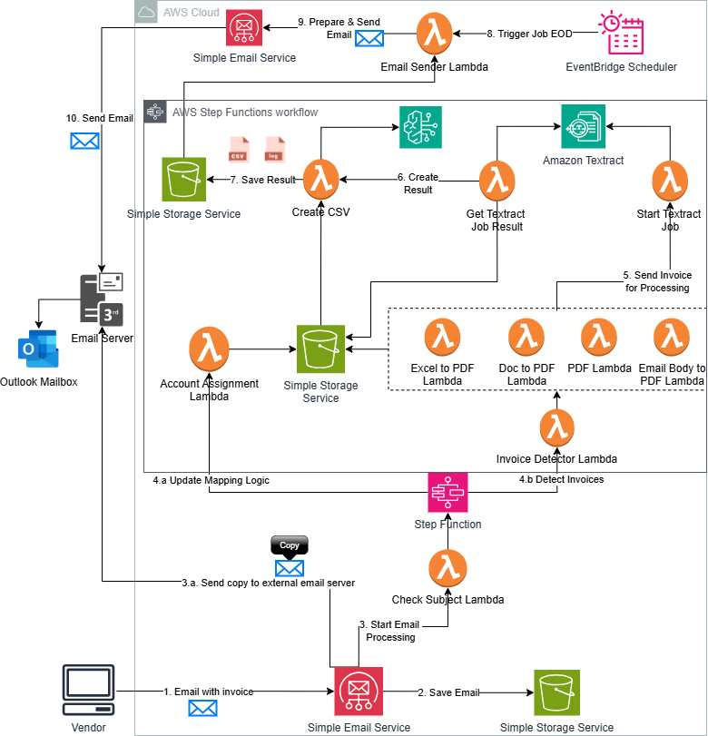

# invoice-processing-app
Invoice processing workflow

## Overview

Many organisations automates the handling of invoices received via email. The system leverages AWS services such as Lambda, Textract, SES, S3, and AWS Bedrock to process invoices, extract relevant data, assign accountants using predefined rules or AI models, and generate daily reports. This system is designed to reduce manual effort, improve accuracy, and ensure scalability in processing large volumes of invoices.

## Features

- **Automated Email Ingestion**: Emails are captured via Amazon SES and stored in S3 for processing.
- **Invoice Data Extraction**: Uses Amazon Textract to extract key invoice details (e.g., Invoice Number, Vendor Name, Amount) from PDF attachments.
- **Account Assignment**: Automatically assigns invoices to the correct accountant using predefined rules stored in S3 by invoking AI model (Claude 3 Haiku) via AWS Bedrock for more complex decisions.
- **Daily Reporting**: Generates and sends daily reports summarizing processed invoices via Amazon SES.
- **Error Handling**: Logs errors encountered during processing and includes them in the daily report.

## Architecture



The system is built using the following AWS services:
- **Amazon S3**: Stores incoming emails, processed artifacts (Textract results), and final CSV reports.
- **AWS Lambda**: Handles various tasks such as email processing, attachment handling, Textract job management, account assignment using AWS Bedrock, and report generation.
- **Amazon Textract**: Extracts text from PDF invoices.
- **AWS Bedrock**: Invokes AI models (e.g., Claude) to determine accountant assignment.
- **Amazon SES**: Sends processed results via email.
- **Amazon EventBridge**: Schedules daily jobs to send reports.

## System Workflow

1. **Email Ingestion**: Emails with invoices are received via Amazon SES and stored in an S3 bucket.
2. **Attachment Processing**: Lambda functions handle different types of attachments (PDFs, Excel, DOC). For PDFs, Textract is used to extract invoice data.
3. **Textract Job Management**: Textract jobs are started for each PDF attachment. The results are retrieved once the job completes successfully.
4. **Invoice Data Extraction**: Key fields like *Invoice Number*, *Vendor Name*, and *Amount* are extracted from Textract results.
5. **Account Assignment**:
   - Predefined rules are applied based on vendor name, invoice number patterns, or sender email addresses to assign an accountant.
   - AWS Bedrock invokes an AI model (Claude) to determine the appropriate accountant based on context.
6. **Daily Report Generation**: A daily report is generated summarizing all processed invoices and errors. It is sent via Amazon SES to designated recipients.

## Prerequisites

1. AWS CLI configured with appropriate permissions.
2. Install [AWS CDK](https://docs.aws.amazon.com/cdk/latest/guide/getting_started.html).
3. Access to necessary AWS services such as S3, Lambda, SES, Step Functions, Textract, and Bedrock.
4. Claude 3 Haiku model enabled in your region.
5. A domain and email addresses for sending and receiving daily reports.


## Deployment Instructions

1. Clone the repository:

```bash
git clone <repository-url>
cd invoice-processing-app
```

2. Install dependencies:
```bash
npm install
```

3. Deploy the stack:
```bash
cdk deploy InvoiceProcessingStack --context domain=<your-domain> --context senderEmail=<your-sender-email> --context recipientEmails=<comma-separated-recipient-emails>
```

4. Verify that SES has been configured with your sender domain:
```bash
aws ses verify-domain-identity --domain <your-domain>
aws ses verify-email-identity --email-address <your-sender-email>
```

## Credits

Developer: Priyam Bansal

Architect: Arun Arunachalam

This project is designed and developed with guidance and support from the ASU Cloud Innovation Center.
